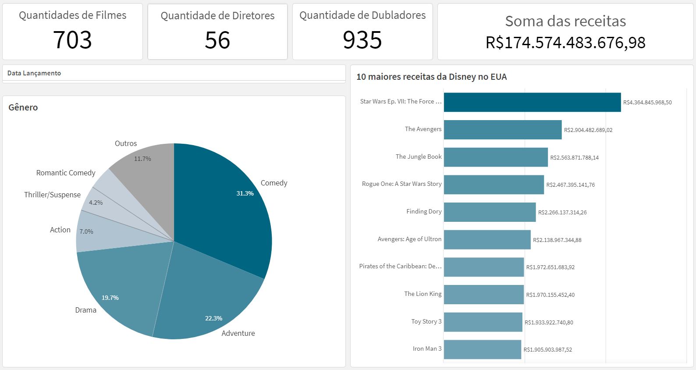
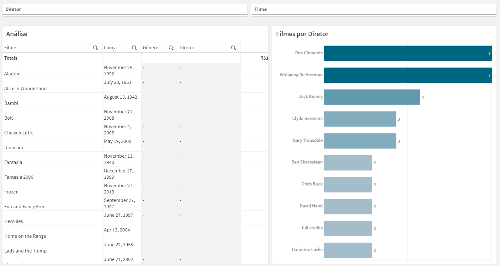

# Dashboard Dados da Disney

**Descrição:** 
 * A contrução do projeto foi baseada na metódologia DAR do Qlik Sense.
 * Baixei o arquivo no formato csv, do site da Kaggle e salvei no banco de dados My SQL (local host).
 * Criei um aplicativo Extract QVD no Qlik com objetivo de extrair esses dados do My SQL e salvar em formato QVD. 
 * Após, criei outro aplicativo chamado Transform QVD, para ler os dados do anterior e tratar esses dados. 
 * Por fim, contruir outro aplicativo chamado Dashboard para ler o aplicativo anterior e comecei a desenvolver o dashboard e depois a análise.
 * Não conseguir fazer o relatório, pois na minha visão precisária de mais dados para poder aprofundar na criação do relatório. 
 
 **Ferrametas e Bibliotecas:**
 * Base de dados é da [Kaggle](https://www.kaggle.com/datasets/maricinnamon/walt-disney-character-dataset)
 * Qlik

**Projeto Final:**
 
 

